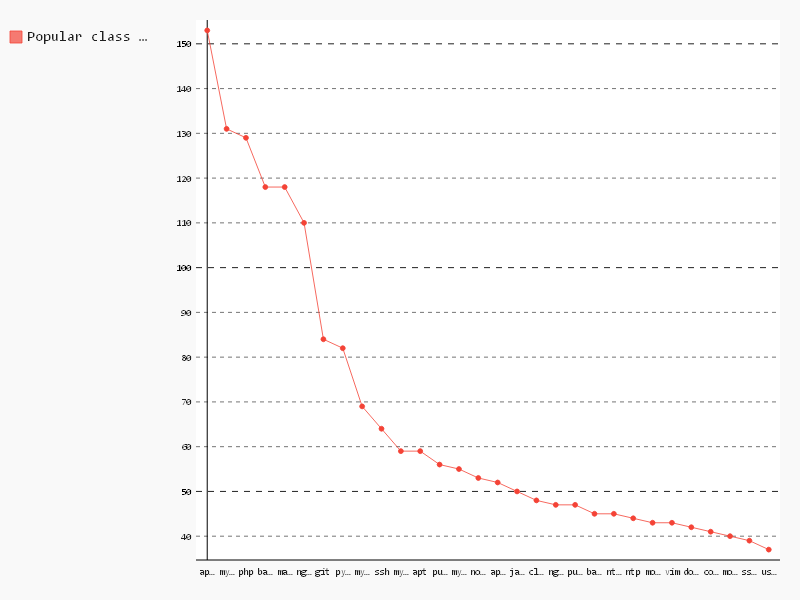

# Popular class names

```sql
-- Class,Count
SELECT
  package,
  COUNT(*) count
FROM (
  SELECT
    REGEXP_EXTRACT(line, r'class (\S+) {') package,
    id
  FROM (
    SELECT
      SPLIT(content, '\n') line,
      id
    FROM
      [puppet.puppet_content]
    WHERE
      content CONTAINS 'class' )
  GROUP BY
    package,
    id )
WHERE
  package IS NOT NULL
GROUP BY
  1
ORDER BY
  count DESC
LIMIT
  30

```

| Class          | Count |
|----------------|-------|
| apache         | 153   |
| mysql          | 131   |
| php            | 129   |
| base           | 118   |
| main           | 118   |
| nginx          | 110   |
| git            | 84    |
| python         | 82    |
| mysql::params  | 69    |
| ssh            | 64    |
| mysql::server  | 59    |
| apt            | 59    |
| puppet::params | 56    |
| mysql::config  | 55    |
| nodejs         | 53    |
| apt_get_update | 52    |
| java           | 50    |
| client         | 48    |
| nginx::params  | 47    |
| puppet         | 47    |
| baseconfig     | 45    |
| ntp::params    | 45    |
| ntp            | 44    |
| motd           | 43    |
| vim            | 43    |
| docker::params | 42    |
| composer       | 41    |
| mongodb        | 40    |
| ssh::params    | 39    |
| users          | 37    |

